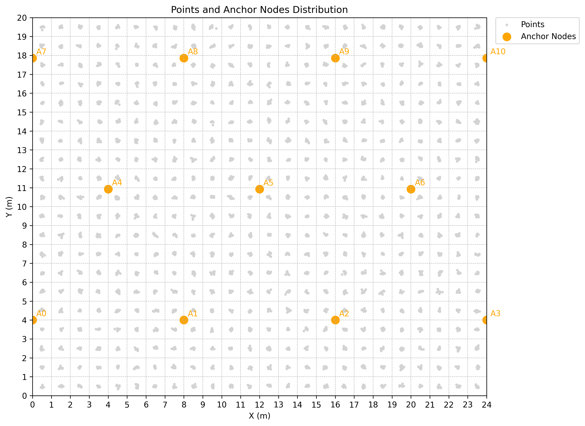
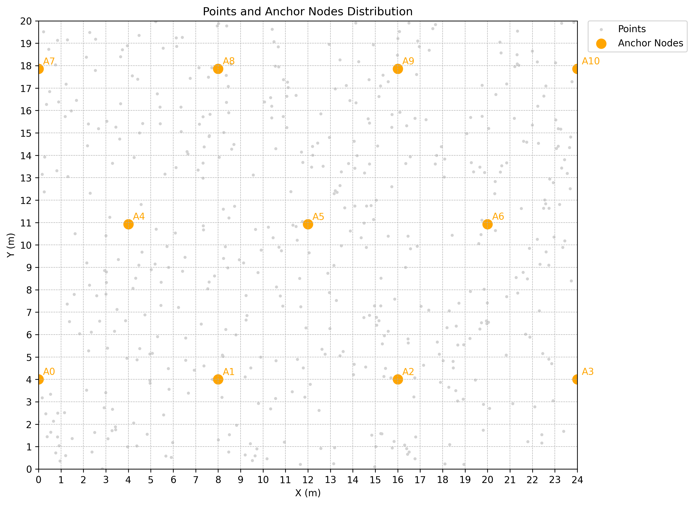

# 📡 RSSI-based Indoor Positioning Dataset

This dataset is designed for developing and benchmarking indoor positioning systems using RSSI (Received Signal Strength Indicator) signals. The data is generated by simulating an unobstructed factory floor and includes comprehensive training and test sets suitable for training, validating, and comparing positioning algorithms.

## 📂 Dataset Structure

```bash
data/
│
├── anchors_pos.csv         # Positions of 11 sensors (anchors)
├── centers_rssi.csv        # Training set: RSSI readings for grid center points
├── centers_pos_cell.csv    # Training set: true (x, y) and cell ID for each point
├── tests_rssi.csv          # Test set: RSSI readings for randomly sampled points
├── tests_pos_cell.csv      # Test set: true (x, y) and cell ID for each test point
│
├── center_points_plot.png  # Training points distribution plot
└── test_points_plot.png    # Test points distribution plot
```

## 📐 Environment Description

- Area size: 20m (X) × 24m (Y)
- Environment: Open space, no obstacles or multipath effects
- Grid division: 1m × 1m grid, total of 480 cells (20 × 24)
- Cell indexing: Left-to-right, bottom-to-top numbering
- Anchors: 11 sensors positioned within the area (`anchors_pos.csv`)

## 🧩 Data Generation

1. Training Data (`centers_*` files)
   - Each grid cell’s center is used as a reference point.
   - Gaussian noise is added to generate realistic sample locations within each cell.
   - RSSI values are computed using a path-loss model.
   - Each cell has 10 samples, totaling 4,800 training samples.
2. Test Data (`tests_*` files)
    - 500 random positions are generated across the entire area.
    - RSSI values are computed using the same path-loss model.
    - Each sample includes true position and cell ID for evaluation.

## 📑 File Descriptions

| File                     | Description           |
| ------------------------ | --------------------- |
| `anchors_pos.csv`        | Anchor sensor coordinates: `sensor_id, x, y`|
| `centers_rssi.csv`       | Training RSSI samples: `rssi_0, ..., rssi_10` |
| `centers_pos_cell.csv`   | Training ground truth: `x, y, cell_id`  |
| `tests_rssi.csv`         | Test RSSI samples: same columns as training RSSI   |
| `tests_pos_cell.csv`     | Test ground truth: `x, y, cell_id` |
| `center_points_plot.png` | Training point distribution  |
| `test_points_plot.png`   | Test point distribution   |

## 🎯 Usage

This dataset can be used for:

- Indoor positioning algorithm development (e.g., KNN, regression, machine learning, or deep learning)
- RSSI signal prediction modeling
- Position estimation and localization accuracy evaluation
- Baseline experiments in an obstacle-free scenario

## 📊 Example Visualizations

| Training Points  | Test Points     |
| ---------------- | --------------------- |
|  |  |
